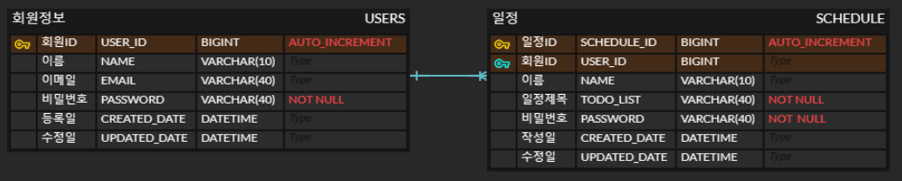

# API 명세서 작성하기

---

| 기능       | Method | URL              | request param                                                 | request body                                                         | response body                                                                                                                                   | 상태코드        | 
|----------| ------ |------------------|---------------------------------------------------------------|----------------------------------------------------------------------|-------------------------------------------------------------------------------------------------------------------------------------------------|-------------| 
| 일정 생성    | POST   | /schedules       |                                                               | {userId : long, todoList : String, name : String, password : String} | {scheduleId : long, userId : long, name : String, password : String, createdDate : LocalDate, updatedDate : LocalDate, todoList : String}       | 201: created |
| 전체 일정 조회 | GET    | /schedules       | userId = {userId}, name = {name}, updatedDate = {updatedDate} |                                                                      | \[ {scheduleId : long, userId : long, name : String, password : String, createdDate : LocalDate, updatedDate : LocalDate, todoList : String} \] | 200: OK     |
| 선택 일정 조회 | GET    | /schedules/{id} | scheduleId = {scheduleId}                                     |                                                                      | {scheduleId : long, userId : long, name : String, password : String, createdDate : LocalDate, updatedDate : LocalDate, todoList : String}       | 200: OK     |
| 선택 일정 수정 | PATCH  | /schedules/{id} | scheduleId = {scheduleId}                                     | {userId : long, todoList : String, name : String, password : String} | {scheduleId : long, userId : long, name : String, password : String, createdDate : LocalDate, updatedDate : LocalDate, todoList : String}       | 200: OK     |
| 선택 일정 삭제 | DELETE | /schedules/{id} | scheduleId = {scheduleId}                                     | {password : String}                                                  | {message : 일정을 삭제하였습니다.}                                                                                                                        | 200: OK     |
| 유저 생성    | POST   | /users           |                                                               | {email : String, name : String, password : String}                   | {userId : long, email : String, name : String, password : String, createdDate : LocalDate, updatedDate : LocalDate}                             | 201: created |
| 전체 유저 조회 | GET    | /users           |                                                               |                                                                      | \[ {userId : long, email : String, name : String, password : String, createdDate : LocalDate, updatedDate : LocalDate} \]                       | 200: OK     |
| 선택 유저 조회 | GET    | /users/{id}     | userId = {userId}                                             |                                                                      | {userId : long, email : String, name : String, password : String, createdDate : LocalDate, updatedDate : LocalDate}                             | 200: OK     |
| 선택 유저 수정 | PATCH  | /users/{id}     | userId = {userId}                                             | {email : String, name : String, password : String}                   | {userId : long, email : String, name : String, password : String, createdDate : LocalDate, updatedDate : LocalDate}                             | 200: OK     |

---

# ERD작성

---
